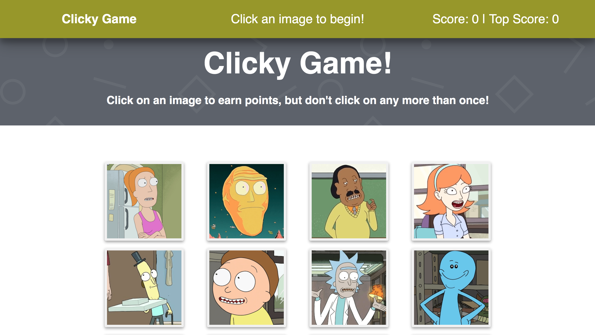

## Clicky Game

A memory game with React. It is broken up by application's UI into components, manage component state, and respond to user events. The application renders different images to the screen. Each image listens for click events.

The application keeps track of the user's score. The user's score increments when clicking an image for the first time. The user's score resets to 0 if they click the same image more than once. Every time an image is clicked, the images rendered to the page shuffles themselves in a random order.

Once the user's score is reset after an incorrect guess, the game restarts.

- - -

The project is useful because it provides an example of languages/technologies I learned and show what I can do as a developer. This application Node.js with React, Bootstrap, HTML, and CSS that is deployed in Heroku.

For questions or concerns, please go to my website at caracrotty.herokuapp.com or send an email at admin@carafelise.com. I maintain and developed this project.